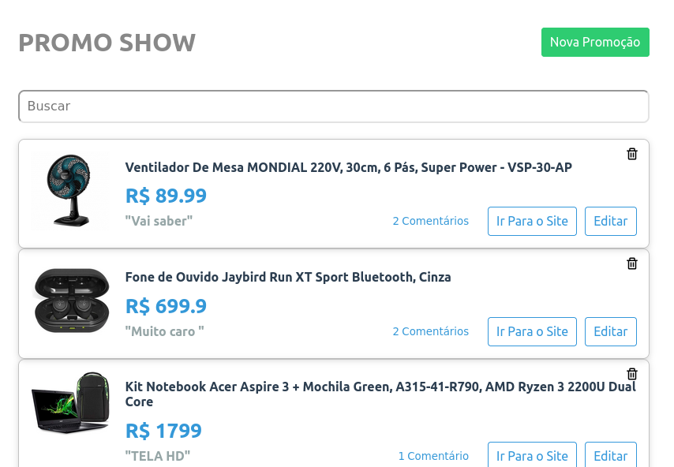

# Gotry

### ✨ Sobre
Projeto realizado junto ao @viniciusdacal espelho do site Gatry.
Iniciando o aprendizado sobre React.

### Imagens

  

### 🔨 Ferramentas
- Html
- CSS
- NodeJs
- React {JSX}

### 🔥 Iniciando

clone

    https://github.com/rafaelcastrobr/gotry-react-projeto.git

Baixar dependências

    yarn

Iniciar pastas /my-app && /api

    yarn start

